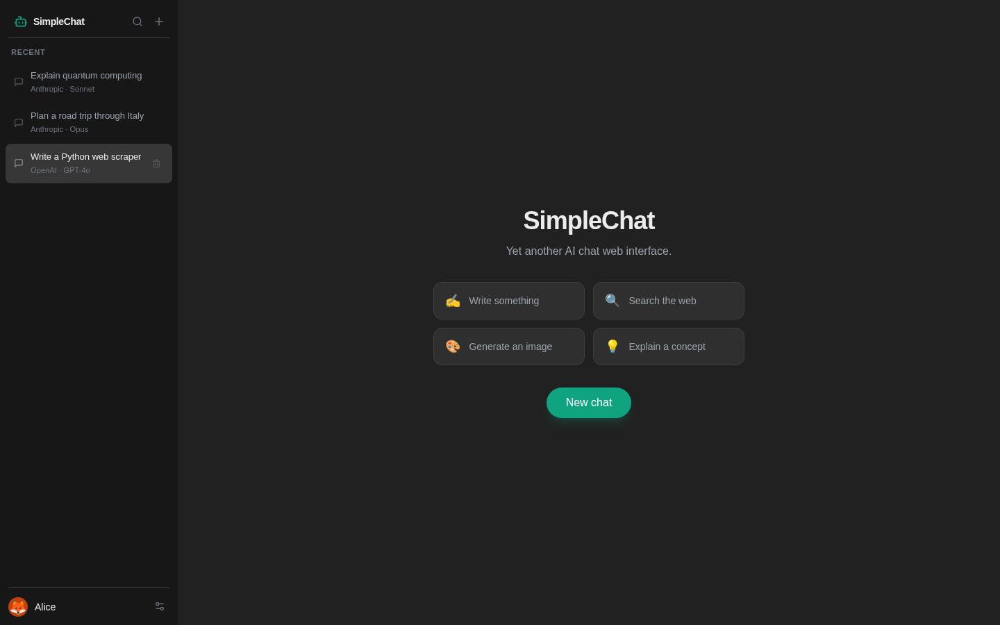
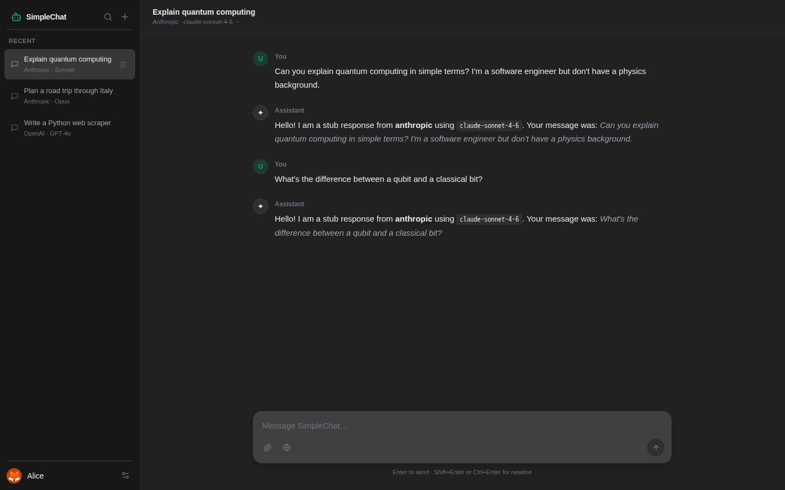

# SimpleChat

A clean, self-hosted AI chat interface supporting both OpenAI and Anthropic models. Multi-profile with per-profile chat history, file attachments, image generation, and web search.





---

## Features

- **Multi-provider** — switch between OpenAI (GPT-4o, o3, etc.) and Anthropic (Claude Sonnet, Opus, Haiku) per chat
- **Multi-profile** — multiple named profiles, each with their own chat history and settings
- **Streaming responses** — real-time token-by-token output via SSE
- **Tool use** — image generation (DALL-E / gpt-image-2) and web search
- **Extended thinking** — renders Claude's thinking blocks in a collapsible UI
- **File attachments** — attach text, JSON, CSV, and Markdown files to messages
- **Markdown rendering** — syntax-highlighted code blocks and full Markdown support
- **Self-contained** — single Docker image, SQLite database, no external dependencies

---

## Quickstart — Docker (recommended)

The easiest way to run SimpleChat is to pull the pre-built image from GitHub Container Registry.

```bash
docker run -d \
  --name simplechat \
  -p 8080:8080 \
  -v simplechat-data:/data \
  -e OPENAI_API_KEY=sk-... \
  -e ANTHROPIC_API_KEY=sk-ant-... \
  ghcr.io/pacanimal/simplechat:latest
```

Then open [http://localhost:8080](http://localhost:8080) in your browser.

Data (database, uploads, generated images) is stored in the `simplechat-data` Docker volume and persists across container restarts.

> You only need the keys for the providers you want to use. Omit `ANTHROPIC_API_KEY` if you only want OpenAI, for example.

---

## Building from source

```bash
git clone https://github.com/PacAnimal/simplechat.git
cd simplechat
docker build -t simplechat .
docker run -d \
  --name simplechat \
  -p 8080:8080 \
  -v simplechat-data:/data \
  -e OPENAI_API_KEY=sk-... \
  -e ANTHROPIC_API_KEY=sk-ant-... \
  simplechat
```

The Dockerfile is a two-stage build: the first stage compiles the React frontend with Node 20, and the second stage runs the FastAPI backend on Python 3.12. The built frontend is embedded in the image and served as static files.

---

## Environment variables

| Variable | Default | Description |
|---|---|---|
| `OPENAI_API_KEY` | — | OpenAI API key. Required for OpenAI models and image generation. |
| `ANTHROPIC_API_KEY` | — | Anthropic API key. Required for Claude models. |
| `DATABASE_URL` | `sqlite+aiosqlite:////data/data/simplechat.db` | SQLite database URL. |
| `UPLOADS_DIR` | `/data/uploads` | Directory for user file attachments. |
| `GENERATED_DIR` | `/data/generated` | Directory for AI-generated images. |
| `LOCAL_PORT` | `8080` | Port the server listens on. |
| `JWT_SECRET` | *(auto-generated)* | Secret used to sign auth tokens. If not set, a random one is generated and written to `/data/data/.jwt_secret` on first start. Set explicitly if you need tokens to survive container restarts without a persistent volume. |
| `CREATE` | `local` | Who can create new profiles. `local` = localhost and RFC-1918 addresses only, `any` = anyone, `none` = nobody (existing profiles still work). |
| `INCOMING_HTTP_PROXY` | `false` | Set to `true` to trust `X-Forwarded-For` / `X-Forwarded-Proto` headers from a local reverse proxy (nginx, Caddy, Traefik, etc.). |
| `PASSWORD_MIN_LENGTH` | `8` | Minimum password length for new profiles. Set to `0` to disable password requirements entirely. |
| `ALLOWED_MODELS` | *(all)* | Comma-separated allowlist of model IDs. Empty = all models are available. Example: `gpt-4o,claude-sonnet-4-6`. |
| `IMAGE_MODEL` | `gpt-image-2` | OpenAI model used for image generation. |

---

## Data storage

All persistent data lives under a single directory, `/data` inside the container. Mount a volume there to keep data across restarts:

```
/data/
├── data/
│   ├── simplechat.db       ← SQLite database (chats, messages, profiles)
│   └── .jwt_secret         ← auto-generated JWT signing key
├── uploads/                ← user file attachments
└── generated/              ← AI-generated images
```

To back up everything, snapshot or copy the mounted volume. To start fresh, delete or replace it.

---

## Reverse proxy

SimpleChat is a plain HTTP server with no TLS. To expose it on the internet, put it behind a reverse proxy (nginx, Caddy, Traefik) and set `INCOMING_HTTP_PROXY=true` so it correctly sees the real client IP for profile creation gating.

Example Caddy config:

```
chat.example.com {
  reverse_proxy localhost:8080
}
```

---

## Running behind a port other than 8080

Set `LOCAL_PORT` and map accordingly:

```bash
docker run -d \
  -p 3000:3000 \
  -e LOCAL_PORT=3000 \
  -e OPENAI_API_KEY=sk-... \
  -v simplechat-data:/data \
  ghcr.io/pacanimal/simplechat:latest
```

---

## Development setup

**Prerequisites:** Node 20+, Python 3.12+

```bash
# backend
python -m venv .venv
.venv/bin/pip install -r requirements.txt
cp .env.example .env   # add your API keys
alembic upgrade head
uvicorn backend.main:app --host 0.0.0.0 --port 8080

# frontend (separate terminal)
cd frontend
npm install
npm run dev            # dev server on :5173 — proxies /api to :8080
```

Open [http://localhost:5173](http://localhost:5173).

### Running tests

```bash
./run-all-tests.sh
```

Runs lint, the frontend build, backend unit tests, and stub E2E Playwright tests (no API keys required).

---

## License

MIT
